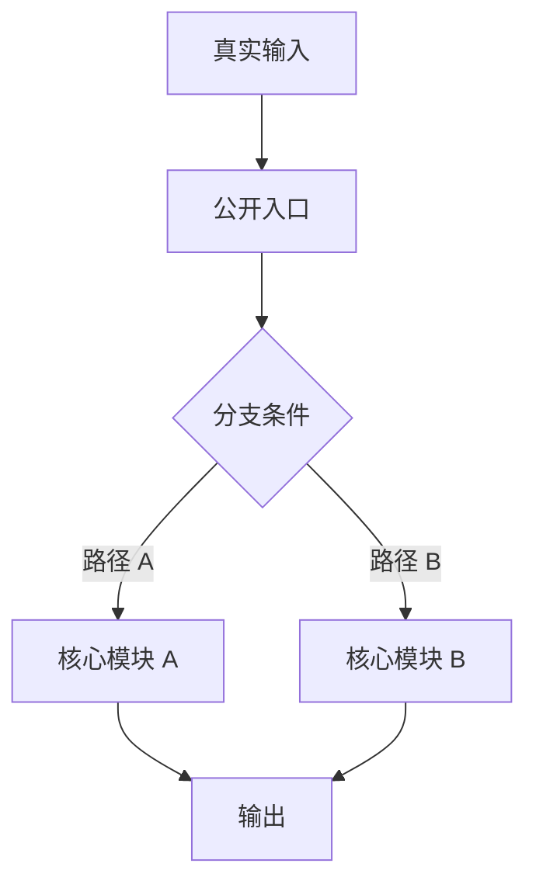

# 章节生成规则

章节由仓库真实主线决定，不由模板决定。模板只提供 mdBook 最小骨架。

## 目录

- [章节设计的核心顺序](#章节设计的核心顺序)
- [Thesis Stress Test](#thesis-stress-test)
- [章节类型与适配规则](#章节类型与适配规则)
- [模块优先级排序](#模块优先级排序)
- [文件命名规则](#文件命名规则)
- [每章固定结构](#每章固定结构)
- [模块深挖：12 个固定问题](#模块深挖12-个固定问题)
- [深度梯度](#深度梯度)
- [Diagram Rules](#diagram-rules)
- [公开边界穷举](#公开边界穷举)
- [测试要当行为规格来读](#测试要当行为规格来读)
- [章节完成标准](#章节完成标准)
- [已知仓库防护](#已知仓库防护)

## 章节设计的核心顺序

不要从目录开始排章节。按这个顺序设计：

1. **仓库 thesis**：这个仓库为什么存在？它用什么核心方式解决问题？
2. **主读者路线**：初学者先抓哪条路径，才能最快进入核心设计？
3. **公开边界**：用户真正接触仓库的入口有哪些？
4. **关键流程**：哪些流程最能解释仓库的核心价值？
5. **模块优先级**：哪些模块是理解设计必须掌握的？哪些只是支撑设施？
6. **横向机制**：测试、配置、构建、错误处理如何保护核心设计？
7. **Demo 反推**：如果重写一个最小版本，必须保留哪些抽象？

章节必须服务这条主线。不要为了覆盖目录而平均铺开。

## Thesis Stress Test

写章节前先用 5 个问题压力测试 thesis：

1. 如果删掉这个仓库，用户会失去什么能力？
2. 它和同类项目最大的设计差异是什么？
3. 代码里哪个模块最能体现这个差异？
4. 哪条执行路径最能证明这个 thesis？
5. 哪些测试或文档能反证或限制这个 thesis？

答不出来时，先回到源码和测试继续研究，不要急着写章节。

## 章节类型与适配规则

| 类型 | 数量 | 目标 |
| --- | --- | --- |
| 阅读指南 | 1 | 快照、thesis、支撑判断、读者路线、图示目录、证据约定 |
| 仓库地图与公开边界 | 1-2 | 顶层分层、公开入口、入口归属、核心模块选择理由 |
| 全局流程 | 1-2 | 入口→调度→核心→输出，全局流程图，真实输入重放 |
| 模块深挖 | 2-6+ | 重要模块的作用、架构、设计意图、协作、边界和失败模式 |
| 横向机制 | 1-2 | 配置、测试语义、错误处理、构建发布、文档漂移 |
| Demo 反推 | 1 | 最小实现的保留/裁剪、目录、步骤、验证 |
| 附录 | 1 | 证据清单、术语表、开放问题、待验证项 |

小型仓库可以合并章节，但不能删除主线、全局流程图、模块架构图、测试语义和 demo 反推。

## 模块优先级排序

先给模块分级，再决定是否成章。

| 等级 | 判断标准 | 处理方式 |
| --- | --- | --- |
| P0 核心模块 | 没有它就无法解释仓库 thesis 或主流程 | 独立深挖章节 + 架构图 + 源码重放 |
| P1 关键支撑 | 支撑核心模块的配置、状态、适配、错误处理或测试语义 | 独立章节或并入横向机制 |
| P2 边缘设施 | 工具脚本、样例、包装层、低频兼容能力 | 放入公开边界、附录或证据清单 |
| P3 噪音/生成物 | 依赖、构建产物、自动生成文件 | 通常排除，只在影响公开边界时说明 |

禁止把 P0 和 P2 写成同等篇幅。没有优先级，就会产生 AI 味。

## 文件命名规则

- 文件名必须使用仓库真实模块名、流程名或主题名。
- 编号只用于排序。
- 禁止使用 `template`、`module-a`、`module-b`、`chapter-x` 等占位名。
- 如果最终文件名和 `templates/mdbook/` 示例高度一致，视为未适配。

好的命名示例：

```text
00-reading-guide.md
01-repo-thesis-and-public-boundaries.md
02-cli-to-core-flow.md
03-parser-module-architecture.md
04-runtime-dispatch-module.md
05-tests-as-behavior-spec.md
06-demo-reimplementation.md
07-evidence-ledger.md
```

## 每章固定结构

每章都应有这四段，但可按仓库需要扩展：

1. **本章回答什么问题**：明确读者读完应解决的疑问。
2. **源码证据**：列出关键文件、符号、测试或命令。
3. **深入解释**：讲作用、设计意图、协作关系、分支、边界和失败模式。
4. **读者应带走的判断**：用 3-5 条具体判断收束，不写泛泛总结。

每章开头的问题必须具体，例如“插件如何改变模块解析路径”，不要写“本章介绍插件模块”。

## 模块深挖：12 个固定问题

每个 P0/P1 模块必须回答：

1. 这个模块在仓库 thesis 里承担什么角色？
2. 它解决什么问题，不解决什么问题？
3. 对外暴露什么接口、类型、配置或事件？
4. 依赖哪些上游和下游模块？协作边界在哪里？
5. 内部架构由哪些组件/类型/状态组成？用模块架构图说明。
6. 核心设计理念或关键取舍是什么？为什么不是更简单的做法？
7. 正常路径如何流动？入口、核心函数、中间状态、输出是什么？
8. 异常、失败、边界情况如何处理？
9. 有哪些扩展点、兼容层或分叉路径？
10. 用一个真实输入做源码级重放：输入 → 分支 → 状态变化 → 输出。
11. 哪些测试定义这个模块的语义？哪些测试保护边界？
12. 最小 demo 里保留什么、裁掉什么、如何验证？

如果模块章节没有回答“为什么这样设计”，就只是职责说明，不算深挖。

## 深度梯度

面向初学者时，不降低深度，而是分层解释：

1. **入口层**：这个概念解决什么用户可见问题。
2. **机制层**：代码如何把问题拆成状态、类型、函数或流程。
3. **取舍层**：为什么这样设计，牺牲了什么，换来了什么。
4. **修改层**：如果要改这里，风险在哪里，先跑哪些测试。

每个复杂概念至少讲到机制层。P0 模块必须讲到取舍层和修改层。

## Diagram Rules

### 全局流程图

必须展示：

- 外部输入或调用入口。
- 入口层、调度层、核心模块、输出层。
- 至少一个真实分叉点。
- 哪些模块共享，哪些模块分叉。

### 模块架构图

每个重要模块必须展示：

- 模块边界。
- 内部组件、核心类型或状态。
- 上游调用者和下游依赖。
- 扩展点、配置点或兼容层。
- 错误/边界处理出口。

### 复杂路径重放图

当仓库价值在解析、编译、调度、匹配、渲染、状态机等逻辑中，必须补一张重放图或序列图。

默认使用 Mermaid：



不要画“目录树伪图”。图必须解释运行关系或架构边界。

## 公开边界穷举

先列公开入口，再研究内部实现。至少覆盖：

- 包入口、子路径、CLI、路由、插件入口。
- 导出表、声明文件、生成代码、注册表。
- 示例、脚本、子命令、配置驱动的动态入口。
- 兼容 shim、适配层、实验入口。

漏掉公开入口，会让读者误解仓库边界。

## 测试要当行为规格来读

测试章节不能只列目录。必须说明：

- 每组测试定义哪类语义。
- 哪些测试压公开 API，哪些压内部模块。
- 哪些测试覆盖边界、失败模式和兼容行为。
- 修改某个模块后应该回归哪些测试。

## 章节完成标准

一个章节完成前，逐条检查：

- 是否服务仓库 thesis？
- 是否说明了为什么这个主题重要？
- 是否至少有一个具体源码证据？
- 是否解释了设计意图或行为边界，而不只是职责描述？
- 如果包含图，图中关键节点和边是否可追溯？
- 读者是否知道继续读哪一章、改代码先看哪里？

## 已知仓库防护

如果目标仓库是知名项目，AI 可能有旧知识。所有结论必须从当前快照源码验证。如果当前源码和常见说法不同，在证据清单中标注漂移。
